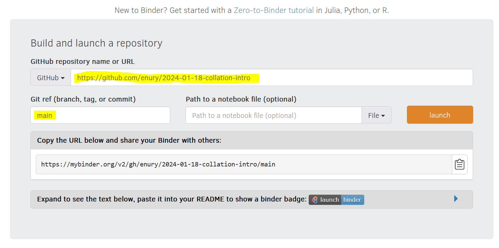

# Workshop *Collation automatique avec CollateX*
Matériel pour workshop sur la collation automatique. Colloque "Du Calame au Clavier" - Grenoble, janvier 2024

Ce dépôt contient la première partie du cours.

La suite se trouve ici: https://github.com/matgille/FormationCalameClavier2024_collation.

---

## Bienvenue !

Clicker sur le bouton pour **lancer Binder** 

Il peut arriver que binder ne se lance pas correctement. Dans ce cans, aller sur le site https://mybinder.org, et entrer les informations requise comme ci-dessous:
1. lien du dépôt github `https://github.com/enury/2024-01-18-collation-intro`
2. branche `main`
3. cliquer sur "Launch"

Ce dépôt restera disponible après le workshop. Pour **télécharger une copie** locale, utiliser le bouton vert "Code" et choisir "Download zip". Si vous savez ce que vous faites, clonez le dépôt !

---

## Contenu

1. Introduction à Jupyter et Python

3. Permiers pas avec CollateX

---

## Crédits

Le matériel de ce workshop réutilise des tutoriels précédents, dont:
  - le workshop [Introduction to Automatic Collation](https://automaticcollationlausanne2020.github.io/), à l'université de Lausanne en septembre 2020,
  - la [Formation Textes et éditions numériques](https://github.com/elespdn/CollateX_tutorial/blob/master/workshopLausanne201904/INTRO.ipynb), à l'université de Lausanne en avril 2019,
  - le workshop DiXiT "Code and Collation: Training Textual Scholars" à Amsterdam en 2016 ([site web](https://sites.google.com/site/dixitcodingcollation/) | [Github](https://github.com/DiXiT-eu/collatex-tutorial)),
  - le [workshop CollateX](http://collatex.obdurodon.org/) de Sydney présenté lors de DH2016.

De nombreuses personnes ont contribué à ces tutoriels, dont Ronald Haentjens Dekker (le dévelopeur principal de CollateX) et, dans l'ordre alphabétique, Tara Andrews, Helena Bermúdez Sabel, David Birnbaum, Elli Bleeker, Elisa Nury, Leif-Jöran Olsson, Elena Spadini, Catherine Smith, Joris Van Zundert.

Ce cours est préparé par Elisa Nury ([grammateus](https://grammateus.unige.ch), projet FNS [#212424](https://data.snf.ch/grants/grant/212424)) et Matthias Gille-Levenson.
